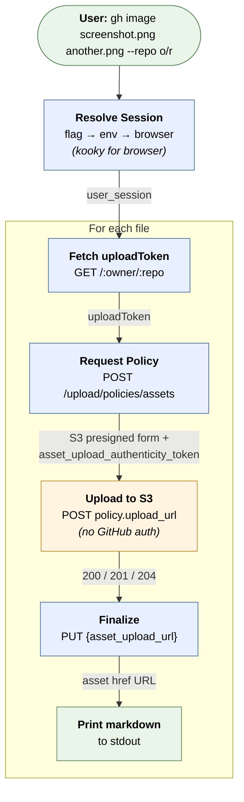

# Architecture

## Overview

`gh-image` is a Go CLI tool distributed as a `gh` extension. It uploads files — images and other GitHub-supported attachments like PDFs and zips — to GitHub using the same internal API that the web UI uses when you drag-and-drop or paste an attachment. The tool resolves a GitHub session (from a flag, env var, or browser cookie store), negotiates upload tokens, performs an S3 presigned upload, then prints the resulting markdown reference to stdout (an image embed for images, a download link for other files).

## Project Structure

```
gh-image/
├── main.go                          # CLI entrypoint, arg parsing, subcommand dispatch
├── main_test.go
├── go.mod
├── go.sum
├── internal/
│   ├── cookies/
│   │   ├── cookies.go               # Browser session cookie extraction via kooky
│   │   ├── cookies_test.go
│   │   ├── jar.go                   # GitHub cookie jar + same-site pair construction
│   │   └── jar_test.go
│   ├── session/
│   │   ├── session.go               # Session token validation (check-token)
│   │   └── session_test.go
│   ├── httputil/
│   │   └── httputil.go              # Shared User-Agent constant
│   ├── upload/
│   │   ├── upload.go                # Orchestrates the 3-step upload flow + HTTP client
│   │   ├── upload_test.go
│   │   ├── token.go                 # Fetches uploadToken from repo page
│   │   ├── token_test.go
│   │   └── s3.go                    # S3 presigned multipart upload
│   └── repo/
│       ├── repo.go                  # Infers owner/repo from git remote, resolves repo ID
│       └── repo_test.go
├── documentation/
│   ├── architecture.md              # This file
│   └── github-image-upload-flow.md  # Reverse-engineered upload protocol
└── .github/
    └── workflows/
        └── release.yml              # GoReleaser cross-compilation + release
```

## CLI Surface

```
gh image [--repo owner/repo] [--token <value>] <file-path>...
gh image extract-token
gh image check-token [--token <value>]
```

- **Default mode** uploads one or more files and prints markdown references to stdout. Flags may appear before or after positional args; use `--` to pass filenames that begin with `-`.
- **`extract-token`** reads the session cookie from the browser and prints the raw token value to stdout (status info to stderr). Useful for piping into CI secrets.
- **`check-token`** resolves a token using the standard precedence (flag → env → browser) and verifies it against GitHub, printing the authenticated username on success.

### Session Token Sources

The session token is resolved with the following precedence (first match wins):

1. `--token <value>` flag
2. `GH_SESSION_TOKEN` environment variable
3. Browser cookie store (via `kooky`)

The flag is convenient for one-off use; the env var is the recommended path for CI/CD and shared machines, since `--token` values are visible in process listings. Browser extraction is the zero-config path for local interactive use.

## Component Design

### 1. Cookie Extraction (`internal/cookies/cookies.go`)

Reads the GitHub `user_session` cookie from local browser cookie stores.

**Dependency:** [`browserutils/kooky`](https://github.com/browserutils/kooky) — a pure Go library that handles:
- Locating each browser's cookie store on disk
- Retrieving encryption keys (macOS Keychain, Windows DPAPI, Linux GNOME Keyring / kwallet)
- AES decryption and cookie DB schema differences across versions
- Per-browser quirks for Chromium-family browsers, Firefox, Safari, and Opera

**Supported browsers** (registered via blank-imported kooky finders): Chrome, Brave, Edge, Chromium, Firefox, Opera, Safari, Vivaldi. `GetGitHubSession` queries all of them in one pass, groups the `user_session` candidates per browser store, and prefers stores that are logged in. When more than one candidate survives, `validate` is used to pick a live one (pass nil to skip network validation).

```go
// GetGitHubSession returns the best user_session cookie for github.com across
// all registered browsers. It groups candidates per browser store, prefers
// stores that are logged in, and when more than one survives uses validate to
// pick a live one (pass nil to skip network validation).
func GetGitHubSession(validate func(*http.Cookie) error) (*http.Cookie, error)
```

The only cookie that needs to be read from the browser is `user_session`. The `__Host-user_session_same_site` cookie is a strict-SameSite duplicate with the same value, so it is synthesized rather than read separately (see Cookie Jar below). The `_gh_sess` cookie rotates with each GitHub response and is managed automatically by the HTTP client's cookie jar.

### 2. Cookie Jar (`internal/cookies/jar.go`)

Constructs an `http.CookieJar` pre-loaded with the `user_session` cookie and its synthesized `__Host-user_session_same_site` counterpart, both scoped to `https://github.com`. GitHub's CSRF validation requires both cookies on the upload endpoints.

```go
// SessionCookiePair returns the user_session cookie and its
// __Host-user_session_same_site counterpart synthesized from it.
func SessionCookiePair(sessionCookie *http.Cookie) [2]*http.Cookie

// NewGitHubCookieJar creates a cookie jar pre-loaded with the session pair
// for https://github.com.
func NewGitHubCookieJar(sessionCookie *http.Cookie) http.CookieJar
```

### 3. Session Validation (`internal/session/`)

Verifies a session cookie is valid by fetching `https://github.com/settings/profile` and inspecting the response. A 200 confirms validity; a redirect to login means the token is expired or invalid. When the response body contains a `<meta name="user-login" ...>` tag, the username is extracted and returned.

```go
// CheckValidity verifies a GitHub session cookie is valid and returns
// the authenticated username on success.
func CheckValidity(sessionCookie *http.Cookie) (string, error)
```

This package is what powers the `check-token` subcommand. It uses `cookies.SessionCookiePair` and `httputil.UserAgent` so its requests look identical to the upload flow's.

### 4. HTTP Utilities (`internal/httputil/`)

Holds shared HTTP plumbing that needs to be consistent across packages. Currently a single `UserAgent` constant — a recent Chrome desktop UA string — used by both the upload flow and the session validator so all GitHub requests present a uniform identity.

### 5. Repository Resolution (`internal/repo/`)

Resolves the target GitHub repository's owner, name, and numeric ID.

If `--repo` is not provided, the tool infers `owner/repo` from the current git workspace by parsing the `origin` remote URL (`git remote get-url origin`). This supports both SSH (`git@github.com:owner/repo.git`) and HTTPS (`https://github.com/owner/repo.git`) remote formats via regex.

The numeric repository ID is resolved via the GitHub REST API (`gh api repos/{owner}/{repo} --jq .id`).

The `git`/`gh` calls go through an injectable command `runner` (the exported
`Resolve` wraps the production `execRun`), so remote-URL and ID parsing are
unit-testable without a real git repo or authenticated `gh`.

```go
// Resolve returns full repo info. If owner/name are empty, it infers from the
// git remote. Internally it delegates to unexported workers (fromRemote,
// lookupID, resolve) that take an injectable command runner.
func Resolve(owner, name string) (*Info, error)
```

### 6. Upload Flow (`internal/upload/`)

Implements the 3-step upload protocol documented in [github-image-upload-flow.md](github-image-upload-flow.md). All GitHub-bound requests use a shared `http.Client` whose cookie jar is built by `cookies.NewGitHubCookieJar`, so `_gh_sess` rotation is handled automatically.

All GitHub requests are issued through a `*Client` that carries the cookie-jar
HTTP client plus a `baseURL` (production `https://github.com`); tests point
`baseURL` at an `httptest` server to exercise the real request/parse code.

```go
// NewClient creates a Client with the GitHub session cookies set and the
// production base URL.
func NewClient(sessionCookie *http.Cookie) *Client

// Upload uploads a file to GitHub and returns the asset URL,
// sanitized filename, and a ready-to-paste markdown reference.
func (c *Client) Upload(owner, repo string, repoID int, path string) (*Result, error)
```

#### Token Retrieval (`token.go`)

Fetches the repository page and extracts the `uploadToken` from the embedded JavaScript payload. This token is specific to the upload endpoint — standard form CSRF tokens do not work.

```go
// getUploadToken fetches the repo page and extracts the uploadToken
// from the JS payload. Requires authenticated cookies in the client.
func (c *Client) getUploadToken(owner, repo string) (string, error)
```

#### Upload Orchestration (`upload.go`)

Coordinates the full flow for a single file:

```
Get upload token
        │
        ▼
requestPolicy()        ──→  POST /upload/policies/assets
        │                    Returns: S3 form fields, asset ID,
        │                    asset_upload_authenticity_token
        ▼
uploadToS3()           ──→  POST {s3_upload_url}
        │                    Multipart form with presigned fields + file
        │                    No GitHub auth needed
        ▼
finalizeUpload()       ──→  PUT {asset_upload_url}
        │                    Path from policy: /upload/assets/{id} (images)
        │                    or /upload/repository-files/{id} (other files)
        │                    Uses asset_upload_authenticity_token from step 1
        ▼
    Returns asset href URL
```

**Key implementation details:**
- The `form` fields from the policy response must be sent to S3 exactly as-is. Adding extra fields (e.g., duplicate `Content-Type`) causes S3 to reject the upload with a 403 policy violation.
- Fields are written in a deterministic order (see `s3FieldOrder` in `s3.go`). Go map iteration is nondeterministic, and we observed empirically that S3 presigned POSTs can be sensitive to field order; the known keys are emitted first, then any unrecognized keys, so future additions still flow through.
- The `file` field must be the **last** field in the multipart form.
- The finalize step uses `asset_upload_authenticity_token` from the policy response, **not** the `uploadToken` from step 0. Each step produces the token needed for the next step (see [Token Relationships](github-image-upload-flow.md#token-relationships)).
- The finalize step is mandatory — without it, the asset URL returns 404.

#### S3 Upload (`s3.go`)

Handles the multipart form construction for the S3 presigned upload. Separated from the main orchestration because the S3 request has different requirements (no cookies, no GitHub headers, just the presigned form fields and file data).

### 7. CLI Entrypoint (`main.go`)

`main()` is a one-line entrypoint that delegates to a testable
`run(args []string, stdout, stderr io.Writer, deps) int`: it returns an exit code
instead of calling `os.Exit`, writes to injected streams, and takes its I/O
boundaries (repo resolution, cookie resolution, upload, extract-token, check-token)
as a `deps` struct, so the full CLI spine is exercised in tests without network,
subprocess, or process exit.

Responsibilities:

- **Manual arg parsing** so that flags can appear before or after positional args, with `--` as an explicit terminator for filenames starting with a dash.
- **Subcommand dispatch** for `extract-token` and `check-token`, with validation that disallowed flag combinations are rejected before any work is done.
- **Session resolution** via `resolveSessionCookie`, which applies the flag → env → browser precedence and wraps raw token values into a properly scoped `*http.Cookie`.
- **Multi-file upload loop**: each positional path is uploaded independently. A failure on one file is reported to stderr and the loop continues; the process exits non-zero if any upload failed.

## Data Flow



## Authentication Model

| Action | Auth Method | Source |
|---|---|---|
| Steps 0, 1, 3 (GitHub requests) | `user_session` + `__Host-user_session_same_site` cookies | `--token` flag, `GH_SESSION_TOKEN`, or browser cookie DB (via kooky) |
| Step 2 (S3 upload) | None | Presigned policy from step 1 |
| Repo ID lookup | OAuth token | `gh` CLI (via `gh auth`) |
| `check-token` validation | Same `user_session` pair | Same precedence as upload |

The session-cookie path and the `gh` CLI auth path are independent. The cookie provides a browser-equivalent session for the undocumented upload API, while `gh` handles the standard REST API used only for looking up the numeric repository ID.

## Distribution

Built as a [`gh` CLI extension](https://cli.github.com/manual/gh_extension):

- Repository is named `gh-image` so it installs as `gh image`
- GoReleaser builds binaries for macOS (arm64, amd64), Linux (amd64, arm64), and Windows (amd64) on tagged releases
- `gh extension install` auto-detects the user's platform and downloads the correct binary from the GitHub Release
- Single static binary, no runtime dependencies (beyond the `gh` CLI and `git`)

### Release Flow

```
git tag vX.Y.Z
git push --tags
→ GitHub Actions triggers
  → GoReleaser cross-compiles
  → Attaches binaries to GitHub Release
→ Users: gh extension install drogers0/gh-image
```

## Dependencies

| Dependency | Purpose |
|---|---|
| [`browserutils/kooky`](https://github.com/browserutils/kooky) | Cross-browser cookie extraction (Keychain / DPAPI / Keyring + AES + SQLite/ESE) |
| Go standard library `net/http` | HTTP client + cookie jar for the upload flow |
| Go standard library `mime/multipart` | Multipart form construction |
| Go standard library `encoding/json` | JSON parsing |
| Go standard library `regexp` | uploadToken and `user-login` extraction |

## Platform Notes

- **macOS:** Fully supported. On first browser-cookie use, a Keychain prompt may appear to authorize access to the browser's cookie encryption key. Click "Always Allow" to avoid repeated prompts. Safari is supported in addition to Chromium-family browsers.
- **Linux:** Supported via kooky (GNOME Keyring / kwallet for Chromium-family key storage; Firefox profile DBs read directly). The upload flow is platform-agnostic.
- **Windows:** Supported via kooky (DPAPI for Chromium-family cookie decryption). Binaries are built for Windows amd64.
- **CI / headless environments:** Use `GH_SESSION_TOKEN` (preferred) or `--token` to skip browser extraction entirely.

## Future Considerations

- **Clipboard image support:** Accept image data from clipboard (`gh image paste --repo o/r`) instead of requiring a file path.
- **Token caching:** The `uploadToken` could be cached briefly to avoid fetching the repo page on every upload within a multi-file batch. The presigned S3 policy expires in ~30 minutes, so reuse is safe within that window.
