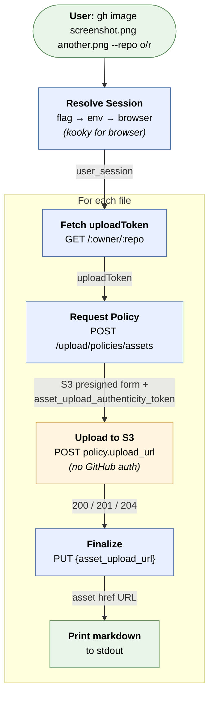

# Architecture

## Overview

`gh-image` is a Go CLI tool distributed as a `gh` extension. It uploads and downloads files — images and other GitHub-supported attachments like PDFs and zips — to GitHub using the same internal API that the web UI uses when you drag-and-drop or paste an attachment. The tool resolves a GitHub session (from a flag, env var, or browser cookie store), negotiates upload tokens, performs an S3 presigned upload, then prints the resulting markdown reference to stdout (an image embed for images, a download link for other files).

## Project Structure

```
gh-image/
├── main.go                          # CLI entrypoint, arg parsing, subcommand dispatch
├── main_test.go
├── go.mod
├── go.sum
├── internal/
│   ├── cookies/
│   │   ├── cookies.go               # Provider-agnostic session-cookie selection
│   │   ├── cookies_test.go
│   │   ├── provider_kooky.go        # Default cookie reader: kooky (//go:build !hbd)
│   │   ├── provider_hbd.go          # Opt-in cookie reader: hackbrowserdata (//go:build hbd)
│   │   ├── retrievers_hbd_*.go      # Per-OS master-key retrievers for the hbd provider
│   │   ├── jar.go                   # GitHub cookie jar + same-site pair construction
│   │   └── jar_test.go
│   ├── session/
│   │   ├── session.go               # Session token validation (check-token)
│   │   └── session_test.go
│   ├── download/
│   │   ├── download.go              # 2-leg attachment download + filename derivation
│   │   └── download_test.go
│   ├── httputil/
│   │   └── httputil.go              # Shared User-Agent constant
│   ├── upload/
│   │   ├── upload.go                # Orchestrates the 3-step upload flow + HTTP client
│   │   ├── upload_test.go
│   │   ├── token.go                 # Fetches uploadToken from repo page
│   │   ├── token_test.go
│   │   └── s3.go                    # S3 presigned multipart upload
│   └── repo/
│       ├── repo.go                  # Infers owner/repo from git remote, resolves repo ID
│       └── repo_test.go
├── documentation/
│   ├── architecture.md                     # This file
│   ├── github-image-upload-flow.md         # Reverse-engineered upload protocol
│   └── github-attachment-download-flow.md  # Reverse-engineered download protocol
└── .github/
    └── workflows/
        └── release.yml              # GoReleaser cross-compilation + release
```

## CLI Surface

```
gh image [--repo owner/repo] [--token <value>] <file-path>...
gh image [--repo owner/repo] [--token <value>] <file-path>... -- <gh args>...
gh image download [--output <file>|-] [--output-dir <dir>] [--no-clobber] [--token <value>] <url>...
gh image extract-token
gh image check-token [--token <value>]
```

- **Default mode** uploads one or more files and prints markdown references to stdout. Flags may appear before or after positional args.
- **Passthrough mode** is the default mode plus a `gh` invocation after `--`. The files upload, the body named by that invocation has its references repointed at the uploaded assets, and `gh` runs with its own stdout, stderr and exit code passed through. Nothing right of `--` is parsed beyond the subcommand and the body flag.

> **Note:** `--` previously terminated flag parsing so that filenames beginning with `-` could be passed positionally. Passthrough claims the separator, so such a filename is now given as `./-name.png`.
- **`download`** fetches one or more `user-attachments` URLs. With no output flag each lands in the current directory under a name derived from the URL; `--output-dir` picks a different directory, `--output <file>` an exact path, and `--output -` streams to stdout. Existing files are overwritten unless `--no-clobber` is given, which suffixes `.1`, `.2` instead.
- **`extract-token`** reads the session cookie from the browser and prints the raw token value to stdout (status info to stderr). Useful for piping into CI secrets.
- **`check-token`** resolves a token using the standard precedence (flag → env → browser) and verifies it against GitHub, printing the authenticated username on success.

### Session Token Sources

The session token is resolved with the following precedence (first match wins):

1. `--token <value>` flag
2. `GH_SESSION_TOKEN` environment variable
3. Browser cookie store (via the selected cookie provider — `kooky` by default)

The flag is convenient for one-off use; the env var is the recommended path for CI/CD and shared machines, since `--token` values are visible in process listings. Browser extraction is the zero-config path for local interactive use.

## Component Design

### 1. Cookie Extraction (`internal/cookies/cookies.go`)

Reads the GitHub `user_session` cookie from local browser cookie stores.

**Cookie provider (build-tag-selected):** `cookies.go` holds the pure selection logic; the browser read (`readRawCookies`) is delegated to one of two interchangeable backends, chosen at compile time. Only one is linked per binary:
- **default** (`//go:build !hbd`) — [`browserutils/kooky`](https://github.com/browserutils/kooky)
- **`-tags hbd`** — [`moond4rk/hackbrowserdata`](https://github.com/moonD4rk/HackBrowserData), with per-OS master-key retrieval kept to the native path (no macOS login-password prompt, no Windows App-Bound-Encryption injection)

Both handle store discovery, per-OS key retrieval (macOS Keychain, Windows DPAPI, Linux GNOME Keyring / kwallet), AES decryption, and per-browser schema quirks. The version or fork of the active provider is pinned in `go.mod`.

**Supported browsers:** Chrome, Brave, Edge, Chromium, Firefox, Opera, Safari — the kooky provider registers these via blank-imported finders; the hbd provider discovers them internally. `GetGitHubSession` queries all of them in one pass, groups the `user_session` candidates per browser store, and prefers stores that are logged in. When more than one candidate survives, `validate` is used to pick a live one (pass nil to skip network validation).

```go
// GetGitHubSession returns the best user_session cookie for github.com across
// all registered browsers. It groups candidates per browser store, prefers
// stores that are logged in, and when more than one survives uses validate to
// pick a live one (pass nil to skip network validation).
func GetGitHubSession(validate func(*http.Cookie) error) (*http.Cookie, error)
```

The only cookie that needs to be read from the browser is `user_session`. The `__Host-user_session_same_site` cookie is a strict-SameSite duplicate with the same value, so it is synthesized rather than read separately (see Cookie Jar below). The `_gh_sess` cookie rotates with each GitHub response and is managed automatically by the HTTP client's cookie jar.

### 2. Cookie Jar (`internal/cookies/jar.go`)

Constructs an `http.CookieJar` pre-loaded with the `user_session` cookie and its synthesized `__Host-user_session_same_site` counterpart, both scoped to `https://github.com`. GitHub's CSRF validation requires both cookies on the upload endpoints.

```go
// SessionCookiePair returns the user_session cookie and its
// __Host-user_session_same_site counterpart synthesized from it.
func SessionCookiePair(sessionCookie *http.Cookie) [2]*http.Cookie

// NewGitHubCookieJar creates a cookie jar pre-loaded with the session pair
// for https://github.com.
func NewGitHubCookieJar(sessionCookie *http.Cookie) http.CookieJar
```

### 3. Session Validation (`internal/session/`)

Verifies a session cookie is valid by fetching `https://github.com/settings/profile` and inspecting the response. A 200 confirms validity; a redirect to login means the token is expired or invalid. When the response body contains a `<meta name="user-login" ...>` tag, the username is extracted and returned.

```go
// CheckValidity verifies a GitHub session cookie is valid and returns
// the authenticated username on success.
func CheckValidity(sessionCookie *http.Cookie) (string, error)
```

This package is what powers the `check-token` subcommand. It uses `cookies.SessionCookiePair` and `httputil.UserAgent` so its requests look identical to the upload flow's.

### 4. HTTP Utilities (`internal/httputil/`)

Holds shared HTTP plumbing that needs to be consistent across packages. Currently a single `UserAgent` constant — a recent Chrome desktop UA string — used by both the upload flow and the session validator so all GitHub requests present a uniform identity.

### 5. Repository Resolution (`internal/repo/`)

Resolves the target GitHub repository's owner, name, and numeric ID.

If `--repo` is not provided, the tool infers `owner/repo` from the current git workspace by parsing the `origin` remote URL (`git remote get-url origin`). This supports both SSH (`git@github.com:owner/repo.git`) and HTTPS (`https://github.com/owner/repo.git`) remote formats via regex.

The numeric repository ID is resolved via the GitHub REST API (`gh api repos/{owner}/{repo} --jq .id`).

The `git`/`gh` calls go through an injectable command `runner` (the exported
`Resolve` wraps the production `execRun`), so remote-URL and ID parsing are
unit-testable without a real git repo or authenticated `gh`.

```go
// Resolve returns full repo info. If owner/name are empty, it infers from the
// git remote. Internally it delegates to unexported workers (fromRemote,
// lookupID, resolve) that take an injectable command runner.
func Resolve(owner, name string) (*Info, error)
```

### 6. Upload Flow (`internal/upload/`)

Two routes sit behind a `Router` (`route.go`). It first tries `BearerClient` (`bearer.go`), a single authenticated request to `uploads.github.com` using the `gh` CLI token, and falls back to the browser-session `Client` for anything the bearer route refuses. Nothing about GitHub's constraints is encoded in the router — it attempts the fast path and lets the server's answer decide — but it remembers each *durable* rejection for the rest of the run, keyed by content type for a `422` and run-wide for a `400`/`401`/`403`/`404`. Transient failures are retried on the next file. The session cookie is resolved lazily, on the first file that actually needs the fallback.

The browser-session `Client` implements the 3-step upload protocol documented in [github-image-upload-flow.md](github-image-upload-flow.md). All its GitHub-bound requests use a shared `http.Client` whose cookie jar is built by `cookies.NewGitHubCookieJar`, so `_gh_sess` rotation is handled automatically.

All GitHub requests are issued through a `*Client` that carries the cookie-jar
HTTP client plus a `baseURL` (production `https://github.com`); tests point
`baseURL` at an `httptest` server to exercise the real request/parse code.

```go
// NewClient creates a Client with the GitHub session cookies set and the
// production base URL.
func NewClient(sessionCookie *http.Cookie) *Client

// Upload uploads a file to GitHub and returns the asset URL,
// sanitized filename, and a ready-to-paste markdown reference.
func (c *Client) Upload(owner, repo string, repoID int, path string) (*Result, error)
```

#### Token Retrieval (`token.go`)

Fetches the repository page and extracts the `uploadToken` from the embedded JavaScript payload. This token is specific to the upload endpoint — standard form CSRF tokens do not work.

```go
// getUploadToken fetches the repo page and extracts the uploadToken
// from the JS payload. Requires authenticated cookies in the client.
func (c *Client) getUploadToken(owner, repo string) (string, error)
```

#### Upload Orchestration (`upload.go`)

Coordinates the full flow for a single file:

```
Get upload token
        │
        ▼
requestPolicy()        ──→  POST /upload/policies/assets
        │                    Returns: S3 form fields, asset ID,
        │                    asset_upload_authenticity_token
        ▼
uploadToS3()           ──→  POST {s3_upload_url}
        │                    Multipart form with presigned fields + file
        │                    No GitHub auth needed
        ▼
finalizeUpload()       ──→  PUT {asset_upload_url}
        │                    Path from policy: /upload/assets/{id} (images)
        │                    or /upload/repository-files/{id} (other files)
        │                    Uses asset_upload_authenticity_token from step 1
        ▼
    Returns asset href URL
```

**Key implementation details:**
- The `form` fields from the policy response must be sent to S3 exactly as-is. Adding extra fields (e.g., duplicate `Content-Type`) causes S3 to reject the upload with a 403 policy violation.
- Fields are written in a deterministic order (see `s3FieldOrder` in `s3.go`). Go map iteration is nondeterministic, and we observed empirically that S3 presigned POSTs can be sensitive to field order; the known keys are emitted first, then any unrecognized keys, so future additions still flow through.
- The `file` field must be the **last** field in the multipart form.
- The finalize step uses `asset_upload_authenticity_token` from the policy response, **not** the `uploadToken` from step 0. Each step produces the token needed for the next step (see [Token Relationships](github-image-upload-flow.md#token-relationships)).
- The finalize step is mandatory — without it, the asset URL returns 404.

#### S3 Upload (`s3.go`)

Handles the multipart form construction for the S3 presigned upload. Separated from the main orchestration because the S3 request has different requirements (no cookies, no GitHub headers, just the presigned form fields and file data).

### 7. Download Flow (`internal/download/`)

Implements the download protocol documented in [github-attachment-download-flow.md](github-attachment-download-flow.md). A `GET` on the attachment URL answers with a `302` to a presigned storage URL, so there are two legs with **opposite** credential requirements: the first needs the session cookie pair, the second must carry none at all — an `Authorization` header on the S3 bucket is rejected with a 400, and the presigned URL is its own capability.

```go
// NewClient builds both HTTP clients and both credential routes; a nil
// newBearer pins the run to the session cookie.
func NewClient(newBearer func() (string, error), newCookie func() (*http.Cookie, error), notify func(string)) *Client

// Save resolves ref and writes it, returning the path written.
func (c *Client) Save(ref Ref, dest Dest) (string, error)

// Stream resolves ref and writes its bytes to w (the --output - path).
func (c *Client) Stream(ref Ref, w io.Writer) (int64, error)
```

**Key implementation details:**

- **Two credential routes, bearer first.** The `gh` token is tried before the browser session, so a run that stays on the fast path never touches the cookie store and never prompts for it. A `404` or a `/login` redirect triggers the fallback, since both describe the credential rather than the asset: a `404` is deliberately ambiguous — GitHub answers the same way for an absent asset and for one the credential cannot read — while a redirect to `/login` says outright that the credential is not valid. Either way the session is tried once before the run reports failure. Any other status is surfaced as-is rather than retried, since it says nothing about the credential. An explicit `--token` or `GH_SESSION_TOKEN` pins the run to the session route.
- **Neither client follows redirects.** The resolve leg classifies its own redirect; the fetch leg must not hop onward past that classification.
- **A `302` is classified in a fixed order:** a `/login` target *on github.com* means the session is stale; a target carrying `X-Amz-Signature` is the asset; anything else is a hard error. The order matters — checking the signature first would report an expired session as an unusable-target error. The host check matters too: matching `/login` by path alone would let an unrelated host claim the credential is stale.
- **The destination is opened only after the fetch returns 200**, so a failed request leaves no 0-byte file. A partial write is removed rather than left in place.
- **Filenames come from the URL, never from a response header.** `/files/<id>/<name>` carries its name and GitHub validates it; `/assets/<uuid>` carries none, so the extension is taken from the presigned path. `filepath.Base` at the join keeps a traversal-shaped name inside the destination.
- **Timeouts mirror the upload side:** 30s for the header-only resolve leg, 120s for the transfer, matching `s3.go`.

### 8. Passthrough Delegation (`internal/passthrough/`)

Runs the `gh` command given after `--`, choosing between two routes without encoding
anything about upstream's policy.

- **Capability probe.** Reads `gh issue comment --help` once per run and looks for
  `--attach`. A feature probe rather than a version comparison, so backports and forks
  behave correctly.
- **Route choice.** For `comment` and `edit`, `--attach <file>` is appended to the
  forwarded argv and `gh` is executed. For `create`, delegation is skipped entirely:
  a create has no pre-existing resource to inspect, so a partial upload could not be
  distinguished from a clean failure, and a retry would open a second issue or PR.
- **Refusal handling.** A non-zero exit is not assumed to mean nothing happened —
  upstream writes the body when at least one asset uploaded, including after a partial
  failure. The target is read once, looking for a comment or revision authored by the
  viewer at or after the moment `gh` was launched. Nothing posted means the local route
  runs; something posted means the command stops and reports. No error text is parsed,
  so upstream rewording cannot break the decision.
- **Local route.** Uploads through `internal/upload` as usual, rewrites the body's
  references with `internal/rewrite`, and re-executes the original argv against the
  rewritten body. The `Router` is unchanged, so a refusal costs one duplicate bearer
  request before the session route.

`gh` itself is located the way `gh` locates itself — `GH_PATH` when set, otherwise
`gh` from `PATH` — so the binary that launched the extension is the one invoked.
Execution is direct, never through a shell, so nothing in the forwarded argv is
reinterpreted.

### 9. Reference Rewriting (`internal/rewrite/`)

Repoints a body's markdown references at uploaded assets, for the route `gh` did not
take. Parses with `goldmark`, walks link and image nodes, and replaces destinations
matching a path that was handed in — the paths are known up front, so no general
search of the document is needed.

Deliberately narrow: inline references only, with reference-style links reported as an
error rather than silently ignored; a file the body never names is appended; a video
is emitted as a bare URL on its own line rather than reproducing upstream's placement
rules. A body supplied through an editor cannot be rewritten, so a passthrough command
with no body flag is refused before anything uploads.

### 10. CLI Entrypoint (`main.go`)

`main()` is a one-line entrypoint that delegates to a testable
`run(args []string, stdout, stderr io.Writer, deps) int`: it returns an exit code
instead of calling `os.Exit`, writes to injected streams, and takes its I/O
boundaries (repo resolution, cookie resolution, upload, extract-token, check-token)
as a `deps` struct, so the full CLI spine is exercised in tests without network,
subprocess, or process exit.

Responsibilities:

- **Manual arg parsing** so that flags can appear before or after positional args, splitting the line at `--` into this extension's arguments and a `gh` invocation to forward.
- **Subcommand dispatch** for `extract-token` and `check-token`, with validation that disallowed flag combinations are rejected before any work is done.
- **Session resolution** via `resolveSessionCookie`, which applies the flag → env → browser precedence and wraps raw token values into a properly scoped `*http.Cookie`.
- **Multi-file upload loop**: each positional path is uploaded independently. A failure on one file is reported to stderr and the loop continues; the process exits non-zero if any upload failed.
- **Download loop**: same contract for URLs. All flag validation happens before any request, so a bad combination fails immediately. `--output -` streams to `run`'s injected stdout writer rather than `os.Stdout`, keeping the path testable.

## Data Flow


```mermaid
flowchart TD
    Start(["<b>User:</b> gh image screenshot.png another.png --repo o/r"])
    Session["<b>Resolve Session</b><br/>flag → env → browser<br/><i>(kooky for browser)</i>"]

    Start --> Session

    subgraph PerImage ["For each file"]
        direction TB
        Token["<b>Fetch uploadToken</b><br/>GET /:owner/:repo"]
        Policy["<b>Request Policy</b><br/>POST /upload/policies/assets"]
        S3["<b>Upload to S3</b><br/>POST policy.upload_url<br/><i>(no GitHub auth)</i>"]
        Finalize["<b>Finalize</b><br/>PUT {asset_upload_url}"]
        Print["<b>Print markdown</b><br/>to stdout"]

        Token -- "uploadToken" --> Policy
        Policy -- "S3 presigned form +<br/>asset_upload_authenticity_token" --> S3
        S3 -- "200 / 201 / 204" --> Finalize
        Finalize -- "asset href URL" --> Print
    end

    Session -- "user_session" --> Token

    classDef ghAuth fill:#e8f0ff,stroke:#4a6fa5,color:#000
    classDef s3 fill:#fff4e0,stroke:#c08a2e,color:#000
    classDef terminal fill:#e8f5e8,stroke:#5a8a5a,color:#000
    class Session,Token,Policy,Finalize ghAuth
    class S3 s3
    class Start,Print terminal
```

## Authentication Model

| Action | Auth Method | Source |
|---|---|---|
| Steps 0, 1, 3 (GitHub requests) | `user_session` + `__Host-user_session_same_site` cookies | `--token` flag, `GH_SESSION_TOKEN`, or browser cookie DB (via kooky) |
| Step 2 (S3 upload) | None | Presigned policy from step 1 |
| Repo ID lookup | OAuth token | `gh` CLI (via `gh auth`) |
| `check-token` validation | Same `user_session` pair | Same precedence as upload |
| Download resolve leg (fast) | `Authorization: Bearer` | `gh auth token`, skipped when a session token is named |
| Download resolve leg (fallback) | `user_session` + `__Host-user_session_same_site` cookies | `--token` flag, `GH_SESSION_TOKEN`, or browser cookie DB |
| Download fetch leg | **None** | Presigned URL from the resolve leg |

Download uses the same two routes as upload, for the same reason: the `gh` token avoids the browser entirely when it works. The routing is simpler here, though. Upload has to remember rejections *per content type*, because the bearer upload endpoint accepts a narrow set; download has no such split — one credential reaches every attachment — so a single rejection turns the fast route off for the rest of the run.

The session-cookie path and the `gh` CLI auth path are independent. The cookie provides a browser-equivalent session for the undocumented attachment APIs, while `gh` handles the standard REST API used only for looking up the numeric repository ID.

## Distribution

Built as a [`gh` CLI extension](https://cli.github.com/manual/gh_extension):

- Repository is named `gh-image` so it installs as `gh image`
- GoReleaser builds binaries for macOS (arm64, amd64), Linux (amd64, arm64), and Windows (amd64) on tagged releases
- `gh extension install` auto-detects the user's platform and downloads the correct binary from the GitHub Release
- Single static binary, no runtime dependencies (beyond the `gh` CLI and `git`)

### Release Flow

```
git tag vX.Y.Z
git push --tags
→ GitHub Actions triggers
  → GoReleaser cross-compiles
  → Attaches binaries to GitHub Release
→ Users: gh extension install drogers0/gh-image
```

## Dependencies

| Dependency | Purpose |
|---|---|
| [`browserutils/kooky`](https://github.com/browserutils/kooky) | Cross-browser cookie extraction (Keychain / DPAPI / Keyring + AES + SQLite/ESE) |
| Go standard library `net/http` | HTTP client + cookie jar for the upload flow |
| Go standard library `mime/multipart` | Multipart form construction |
| Go standard library `encoding/json` | JSON parsing |
| Go standard library `regexp` | uploadToken and `user-login` extraction |

## Platform Notes

- **macOS:** Fully supported. On first browser-cookie use, a Keychain prompt may appear to authorize access to the browser's cookie encryption key. Click "Always Allow" to avoid repeated prompts. Safari is supported in addition to Chromium-family browsers.
- **Linux:** Supported via kooky (GNOME Keyring / kwallet for Chromium-family key storage; Firefox profile DBs read directly). The upload flow is platform-agnostic.
- **Windows:** Supported via kooky (DPAPI for Chromium-family cookie decryption). Binaries are built for Windows amd64.
- **CI / headless environments:** Use `GH_SESSION_TOKEN` (preferred) or `--token` to skip browser extraction entirely.

## Future Considerations

- **Passthrough for `create`:** delegation is skipped there because a failed `gh` run cannot be distinguished from a partial one. A first-party dry-run, or an upstream guarantee that nothing is written on failure, would let `create` take the native route too.
- **Clipboard image support:** Accept image data from clipboard (`gh image paste --repo o/r`) instead of requiring a file path.
- **Token caching:** The `uploadToken` could be cached briefly to avoid fetching the repo page on every upload within a multi-file batch. The presigned S3 policy expires in ~30 minutes, so reuse is safe within that window.
